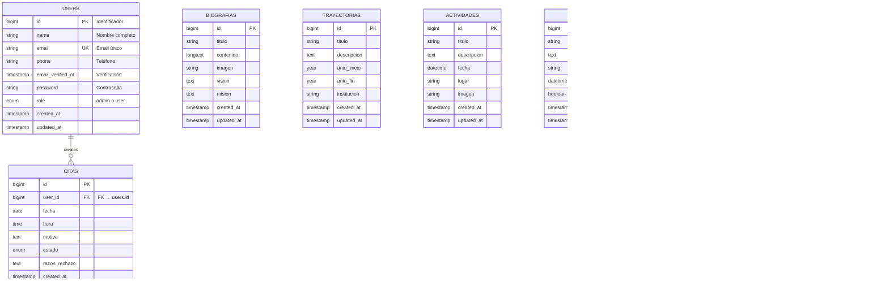

# 📊 DIAGRAMA ENTIDAD-RELACIÓN (ER)

## Página Web de Hugo Raúl - Juntos por el Perú

---

## Diagrama Visual (Mermaid)



---

## Tablas en Detalle

### 1. USERS

```
Relaciones:
├── 1:N con CITAS (Un usuario puede tener muchas citas)

Índices:
├── PRIMARY KEY: id
├── UNIQUE: email
├── INDEX: role (para filtrar admins)
```

### 2. BIOGRAFIAS

```
Características:
├── Tabla de único registro (máximo 1)
├── No tiene relaciones con otras tablas
├── Campos de contenido: titulo, contenido, vision, mision
├── Campo de archivo: imagen
```

### 3. TRAYECTORIAS

```
Características:
├── Tabla de contenido público
├── Sin relaciones directas
├── Ordenable por anio_inicio
├── Soporta períodos abiertos (sin fecha fin)
```

### 4. ACTIVIDADES

```
Características:
├── Tabla de eventos públicos
├── Ordenable por fecha
├── Incluye ubicación (lugar)
├── Soporta imagen de evento
```

### 5. NOTICIAS

```
Características:
├── Tabla de artículos
├── Campo publicado: controla visibilidad pública
├── Ordenable por fecha_publicacion DESC
├── Soporta imagen de portada
```

### 6. CITAS

```
Relaciones:
├── N:1 con USERS (Muchas citas, un usuario)
│    └── ON DELETE CASCADE (si se elimina usuario, se eliminan citas)

Estados posibles:
├── 'pendiente' → Espera aprobación del admin
├── 'aprobado' → Confirmada
└── 'rechazado' → Denegada (con razón)

Flujo de estados:
┌──────────────┐
│  PENDIENTE   │
└──────┬───────┘
       │
       ├──→ APROBADO ✅
       │
       └──→ RECHAZADO ❌
```

### 7. MENSAJES_CONTACTO

```
Características:
├── Sin relación con usuarios (enviado por público)
├── Campo leido: para tracking de admin
├── No requiere autenticación para enviar
├── Ordenable por created_at DESC
```

### 8. PROPUESTAS

```
Características:
├── Tabla de contenido político
├── Sin relaciones
├── Soporta imagen ilustrativa
└── Ordenable por created_at DESC
```

---

## Diagrama de Relaciones Simplificado

```
        ┌─────────────┐
        │    USERS    │
        │ (Usuarios)  │
        └──────┬──────┘
               │ 1
               │
            1:N │
               │
               ├──→ CITAS (Solicitudes legales)
               │    └─ Relacionada directamente
               │
               └──→ Otros módulos
                    └─ Sin relación directa


MÓDULOS INDEPENDIENTES:
    ┌──────────────┐
    │  BIOGRAFIAS  │  (1 registro máximo)
    └──────────────┘

    ┌──────────────┐
    │ TRAYECTORIAS │  (Múltiples registros)
    └──────────────┘

    ┌──────────────┐
    │ ACTIVIDADES  │  (Eventos públicos)
    └──────────────┘

    ┌──────────────┐
    │   NOTICIAS   │  (Con control de publicación)
    └──────────────┘

    ┌──────────────┐
    │  PROPUESTAS  │  (Propuestas políticas)
    └──────────────┘

    ┌──────────────────┐
    │ MENSAJES_CONTACTO│  (Formulario de contacto)
    └──────────────────┘
```

---

## Cardinalidad de Relaciones

| Relación     | Cardinalidad | Descripción                          |
| ------------ | ------------ | ------------------------------------ |
| User → Cita  | 1:N          | Un usuario puede tener muchas citas  |
| Cita → User  | N:1          | Muchas citas pertenecen a un usuario |
| Biografias   | Singleton    | Máximo 1 registro                    |
| Trayectorias | 1:N          | Un candidato, múltiples trabajos     |
| Actividades  | 1:N          | Un candidato, múltiples actividades  |
| Noticias     | 1:N          | Un candidato, múltiples noticias     |
| Propuestas   | 1:N          | Un candidato, múltiples propuestas   |
| Mensajes     | 1:N          | Múltiples mensajes de ciudadanos     |

---

## Cascadas y Restricciones

### Eliminación (ON DELETE)

```
Usuario (User) → DELETE
    ├── Citas asociadas: CASCADE DELETE
    │   └─ Se eliminan automáticamente
    │
    └─ Otros módulos: Sin impacto
       └─ Biografías, Trayectorias, etc.
          no se eliminan
```

### Actualización (ON UPDATE)

```
User ID → UPDATE
    └─ Citas.user_id: CASCADE UPDATE
       └─ Se actualiza automáticamente
```

---

## Esquema de Base de Datos

### Script SQL Completo

```sql
-- Tabla: users
CREATE TABLE users (
    id BIGINT UNSIGNED PRIMARY KEY AUTO_INCREMENT,
    name VARCHAR(255) NOT NULL,
    email VARCHAR(255) UNIQUE NOT NULL,
    phone VARCHAR(20),
    email_verified_at TIMESTAMP NULL,
    password VARCHAR(255) NOT NULL,
    role ENUM('admin', 'user') DEFAULT 'user' NOT NULL,
    created_at TIMESTAMP NULL,
    updated_at TIMESTAMP NULL,
    INDEX idx_role (role),
    INDEX idx_email (email)
);

-- Tabla: biografias
CREATE TABLE biografias (
    id BIGINT UNSIGNED PRIMARY KEY AUTO_INCREMENT,
    titulo VARCHAR(255) NOT NULL,
    contenido LONGTEXT NOT NULL,
    imagen VARCHAR(255),
    vision TEXT,
    mision TEXT,
    created_at TIMESTAMP NULL,
    updated_at TIMESTAMP NULL
);

-- Tabla: trayectorias
CREATE TABLE trayectorias (
    id BIGINT UNSIGNED PRIMARY KEY AUTO_INCREMENT,
    titulo VARCHAR(255) NOT NULL,
    descripcion TEXT NOT NULL,
    anio_inicio YEAR NOT NULL,
    anio_fin YEAR,
    institucion VARCHAR(255) NOT NULL,
    created_at TIMESTAMP NULL,
    updated_at TIMESTAMP NULL,
    INDEX idx_anio_inicio (anio_inicio)
);

-- Tabla: actividades
CREATE TABLE actividades (
    id BIGINT UNSIGNED PRIMARY KEY AUTO_INCREMENT,
    titulo VARCHAR(255) NOT NULL,
    descripcion TEXT NOT NULL,
    fecha DATETIME NOT NULL,
    lugar VARCHAR(255) NOT NULL,
    imagen VARCHAR(255),
    created_at TIMESTAMP NULL,
    updated_at TIMESTAMP NULL,
    INDEX idx_fecha (fecha)
);

-- Tabla: noticias
CREATE TABLE noticias (
    id BIGINT UNSIGNED PRIMARY KEY AUTO_INCREMENT,
    titulo VARCHAR(255) NOT NULL,
    contenido TEXT NOT NULL,
    imagen VARCHAR(255),
    fecha_publicacion DATETIME NOT NULL,
    publicado BOOLEAN DEFAULT FALSE,
    created_at TIMESTAMP NULL,
    updated_at TIMESTAMP NULL,
    INDEX idx_publicado (publicado),
    INDEX idx_fecha_publicacion (fecha_publicacion)
);

-- Tabla: citas
CREATE TABLE citas (
    id BIGINT UNSIGNED PRIMARY KEY AUTO_INCREMENT,
    user_id BIGINT UNSIGNED NOT NULL,
    fecha DATE NOT NULL,
    hora TIME NOT NULL,
    motivo TEXT NOT NULL,
    estado ENUM('pendiente', 'aprobado', 'rechazado') DEFAULT 'pendiente',
    razon_rechazo TEXT,
    created_at TIMESTAMP NULL,
    updated_at TIMESTAMP NULL,
    FOREIGN KEY (user_id) REFERENCES users(id) ON DELETE CASCADE,
    INDEX idx_user_id (user_id),
    INDEX idx_estado (estado),
    INDEX idx_fecha (fecha)
);

-- Tabla: mensajes_contacto
CREATE TABLE mensajes_contacto (
    id BIGINT UNSIGNED PRIMARY KEY AUTO_INCREMENT,
    nombre VARCHAR(255) NOT NULL,
    correo VARCHAR(255) NOT NULL,
    telefono VARCHAR(20),
    mensaje TEXT NOT NULL,
    leido BOOLEAN DEFAULT FALSE,
    created_at TIMESTAMP NULL,
    updated_at TIMESTAMP NULL,
    INDEX idx_leido (leido),
    INDEX idx_correo (correo)
);

-- Tabla: propuestas
CREATE TABLE propuestas (
    id BIGINT UNSIGNED PRIMARY KEY AUTO_INCREMENT,
    titulo VARCHAR(255) NOT NULL,
    descripcion TEXT NOT NULL,
    imagen VARCHAR(255),
    created_at TIMESTAMP NULL,
    updated_at TIMESTAMP NULL
);
```

---

## Estadísticas de Tablas

| Tabla             | Campos | Tipo          | Relación  | Crecimiento |
| ----------------- | ------ | ------------- | --------- | ----------- |
| users             | 9      | Core          | 1         | Bajo        |
| biografias        | 8      | Content       | Singleton | Muy Bajo    |
| trayectorias      | 8      | Content       | 1:N       | Bajo        |
| actividades       | 8      | Content       | 1:N       | Medio       |
| noticias          | 8      | Content       | 1:N       | Medio       |
| citas             | 9      | Transactional | N:1       | Alto        |
| mensajes_contacto | 8      | Transactional | None      | Alto        |
| propuestas        | 7      | Content       | 1:N       | Bajo        |

**Crecimiento Esperado:**

-   **Bajo:** < 1,000 registros/año
-   **Medio:** 1,000 - 10,000 registros/año
-   **Alto:** > 10,000 registros/año
-   **Muy Bajo:** < 10 registros totales

---

## Normalizando la Base de Datos

### Forma Normal 1 (1FN)

✅ **Cumplida:** Todos los campos contienen valores atómicos

### Forma Normal 2 (2FN)

✅ **Cumplida:** Todos los campos dependen completamente de la clave primaria

### Forma Normal 3 (3FN)

✅ **Cumplida:** No hay dependencias transitivas entre campos

### Forma Normal de Boyce-Codd (FNBC)

✅ **Cumplida:** La base de datos está bien normalizada

---

## Índices y Performance

### Índices Implementados

```sql
-- USERS
INDEX idx_role ON users(role)
    └─ Para filtrar admins rápidamente

INDEX idx_email ON users(email)
    └─ Para login rápido (UNIQUE ya crea índice)

-- TRAYECTORIAS
INDEX idx_anio_inicio ON trayectorias(anio_inicio)
    └─ Para ordenar cronológicamente

-- ACTIVIDADES, NOTICIAS, CITAS
INDEX idx_fecha/idx_fecha_publicacion
    └─ Para filtrar y ordenar por fecha

-- NOTICIAS
INDEX idx_publicado ON noticias(publicado)
    └─ Para filtrar noticias publicadas

-- CITAS
INDEX idx_user_id ON citas(user_id)
    └─ Para relación con usuarios

INDEX idx_estado ON citas(estado)
    └─ Para filtrar pendientes
```

### Mejoras de Performance

```sql
-- Consulta lenta (sin índice):
SELECT * FROM citas WHERE fecha > '2025-01-01'
    └─ Escaneo completo de tabla

-- Consulta rápida (con índice):
SELECT * FROM citas WHERE estado = 'pendiente'
    └─ Usa índice idx_estado (muy rápido)

-- Optimización: Consultas multitabla
SELECT u.name, c.fecha, c.estado
FROM users u
INNER JOIN citas c ON u.id = c.user_id
WHERE c.estado = 'pendiente'
    └─ Usa índices de ambas tablas
```

---

## Backups Recomendados

### Tabla por Criticidad

**CRÍTICA (Backup diario):**

-   users (perder datos de usuario = problema)
-   citas (perder solicitudes = reclamos)

**IMPORTANTE (Backup semanal):**

-   noticias
-   propuestas
-   actividades

**NORMAL (Backup mensual):**

-   biografias
-   trayectorias
-   mensajes_contacto

---

## Migración Futura

Si necesitas expandir la BD:

```sql
-- Ejemplo: Agregar tabla de Comentarios
CREATE TABLE comentarios (
    id BIGINT UNSIGNED PRIMARY KEY AUTO_INCREMENT,
    user_id BIGINT UNSIGNED NOT NULL,
    noticia_id BIGINT UNSIGNED NOT NULL,
    contenido TEXT NOT NULL,
    created_at TIMESTAMP NULL,
    updated_at TIMESTAMP NULL,
    FOREIGN KEY (user_id) REFERENCES users(id) ON DELETE CASCADE,
    FOREIGN KEY (noticia_id) REFERENCES noticias(id) ON DELETE CASCADE,
    INDEX idx_noticia_id (noticia_id)
);
```

---

Fin del documento ER.
